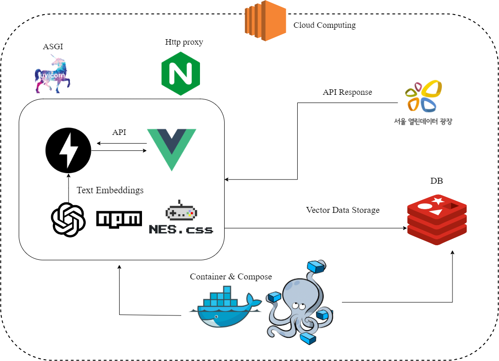
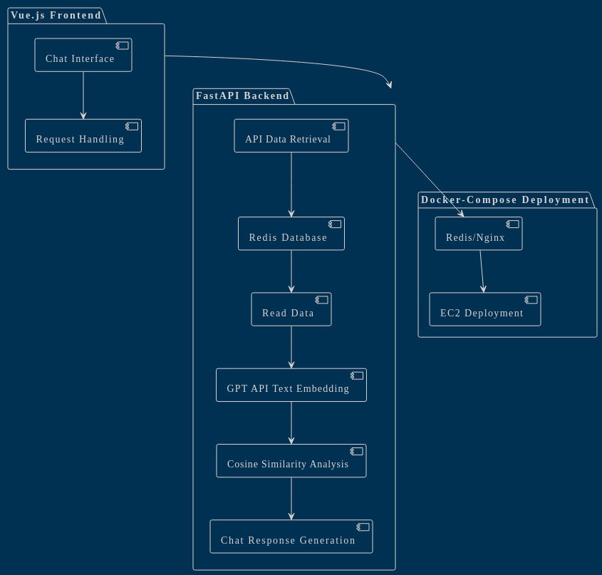
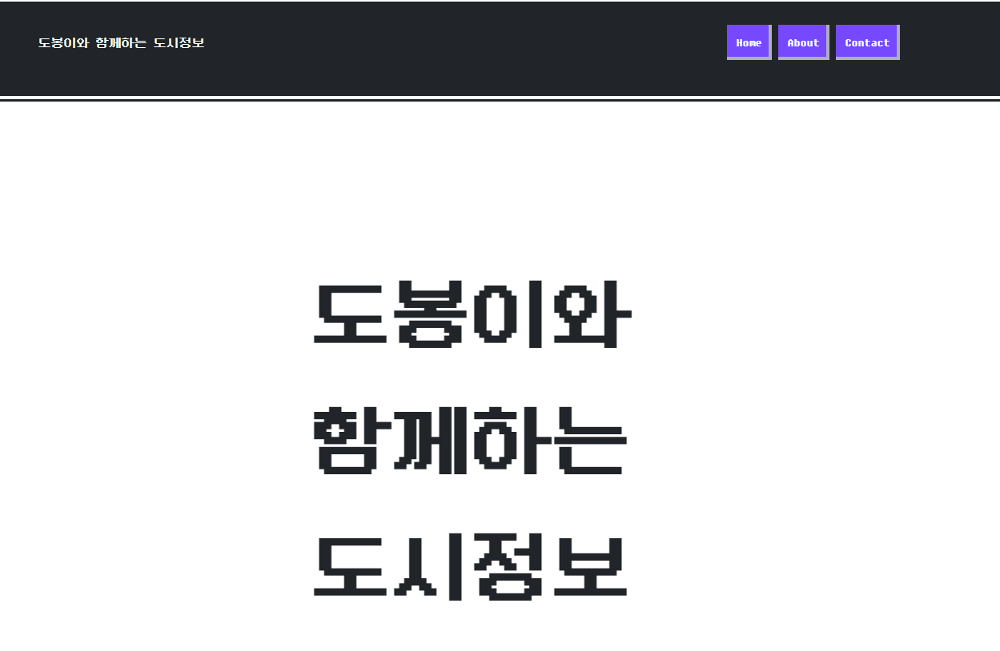
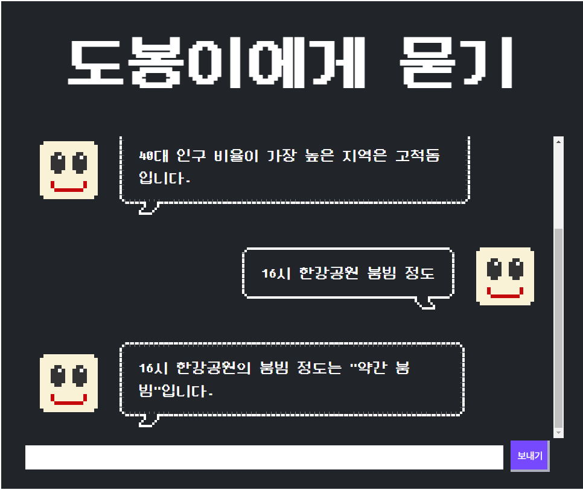

## SeSac 미니프로젝트 LLM을 활용한 나만의 챗봇 만들기 

## 사용 기술 
* 언어 : Python,javaScript
* 프레임워크 : Vue.js,FastAPI
* 사용 API : ChatGPT API, 서울시 인구데이터(혼잡도)
* DB : redis
* VM,container : Docker,Docker-compose
* Cloud : AWS EC2(사용 예정)

-----
* 개요 
    - Chat GPT를 활용한 프롬프트 엔지니어링 기초 프로젝트 
    - 일상속 혼잡도 데이터를 활용하여 서울 근방 여행 전, 연인들이 데이트 코스 선정 전 미리 혼잡도를 확인하여 데이트코스 선정에 도움이 되고자 하는 마음에 시작 
----
## 시스템 아키텍처 

----
## 프로젝트 아키텍처(다이어그램)

----
## 메인 페이지 

* nes.css라는 npm 패키지를 기반으로 import 하였음
----
## LLM 운용 페이지 

* fastapi post 메소드를 이용해서 데이터를 전달 ↔ 매핑 후 리스폰 방식으로 데이터 주고 받기 완료 

----- 
## 추후 개선사항 
* 네비게이션 bar에 있는 요소들은 아직 라우터 연결이 미비한 상태 
* 벡터 데이터가 담기지 않은 데이터프레임은 MySQL을 기반으로 사용을 해야하는가? → 과잉 서버 사용이 아닌지에 대한 고민이 필요 
* API를 통해 받아온 반정형 데이터는 S3 버킷을 사용해야 할지? 한번 더 고민해야 할 부분인듯 

---- 
## 아쉬운점 
* CSS 뭔가 좀 부족하게 채워진 느낌이 든다. 
* 이걸 나중에 상품화를 어떤 방식으로 하면 좋을지?에 대한 의문